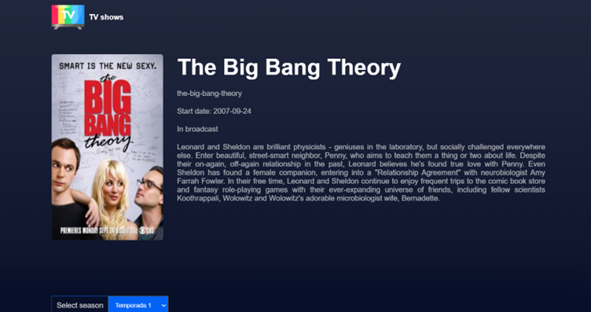
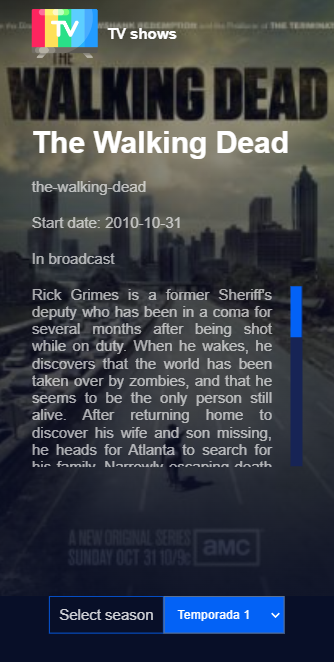

# Tv Show API

SPA using TV Shows API

----------

## Buenas practicas

1. Estructura del proyecto: un componente por archivo.
   
2. Redux: centralizacion de la informacion de la aplicacion.
   
3. Hooks personalizados: encapsulamiento de logica reutilizable.
   
4. Renderizado condicional: renderizado de componentes condicionalmente.

5. Nombres variables: nombres descriptivos y facil de interpretar.
   
6. Principio DRY (Don't Repeat Yourself): Utilizacion de funciones para evitar la repeticion de codigo.

----------

## Componentes

- AppRouter --> Manejo de las rutas
  
- MainPage --> Vista pagina principal
- SingleTvShowPage --> Vista Tv Show por el id
- TvShows --> Contenedor de los resultados de la API
- TvShowsCard --> Listado de cada uno de los tv shows
- HeaderLayout --> Cascaron del header
- Header --> Contendor data dinamica de la vista principal
- NavBar --> Menu de navegacion
- SearchField --> Input encargado de la busqueda
- SearchFieldCard --> Listado de los resultados de la busqueda
- SingleTvShowInfo --> Informacion tv show mediante el id
- Episodes --> Contenedor de los episodios
- EpisodesCard --> Listado de cada uno de los episodios
- Pagination --> Paginado de la pagina
- Loader --> Loader para mejorar la experiencia de usuario

----------

## Vistas

#### Escritorio: Vista ruta principal

#### Escritorio: Vista Tv show por el id

#### Movil: Vista ruta principal

#### Movil: Vista Tv show por el id

